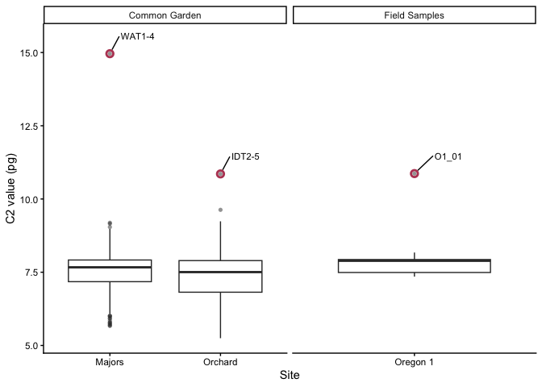
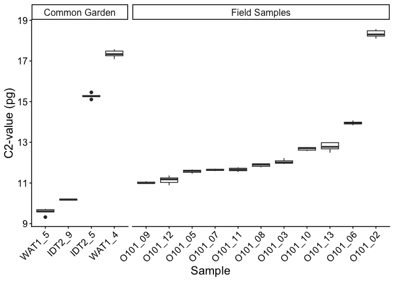
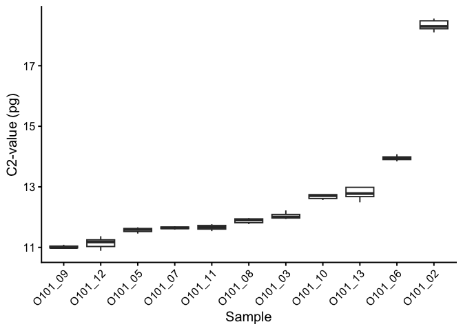

Ploidy_Analysis
================
Lukas P. Grossfurthner
2026-03-13

- [Ploidy Analysis](#ploidy-analysis)
- [Estimate genome sizes based on DAPI of samples and combine data
  sets](#estimate-genome-sizes-based-on-dapi-of-samples-and-combine-data-sets)
  - [Analyze the triploid offspring analyzed with Propidium Iodide
    (PI)](#analyze-the-triploid-offspring-analyzed-with-propidium-iodide-pi)

## Ploidy Analysis

Workflow used to estimate genome sizes and to visualize the resulting
data. For screening greenhouse samples, samples were run on the FCM
once, for the field data, samples were run three times and the average
of the measurements was taken.

``` r
genome_size_std <- 0.535 # genome size of A. negundo as identified by Contreras et al. 2007
greenhouse_data <- read_xlsx("data/tables/Atri_greenhouse_ploidy.xlsx", sheet=2)
triploid_offspring_PI <- read_excel("../triploid/greenhouse_samples/data/Triploid_Offspring_measurements.xlsx")
colnames(greenhouse_data) <- c("Sample_ID", "Garden", "Source", "Flat_ID", "Ratio","C2_value", "Original_Reseed")
field_data <- read_xlsx("../triploid/greenhouse_samples/data/Atri_field_ploidy.xlsx")
```

## Estimate genome sizes based on DAPI of samples and combine data sets

``` r
ploidy_plot <- ploidies_combined %>%
  mutate(origin=ifelse(grepl("Oregon",Site), "Field Samples", "Common Garden"),
         Sample_ID.1=ifelse(!grepl("O1", Sample_ID),
                            str_remove_all(Sample_ID,"_.+"), 
                            Sample_ID)) %>% 
  filter(!grepl("Oregon 2", Site)) %>% #group_by(origin) %>% summarize(mean=mean(C2_value), sd=sd(C2_value))
  ggplot(aes(x=Site, y=C2_value))+
  geom_boxplot(outlier.alpha = 0.5, outlier.shape = 16)+ #outlier.colour = "#b94663", outlier.shape = 1, outlier.stroke = 1.5
  geom_point(data= ~subset(., C2_value > 10), stroke=1.5, size=2, pch=1, col="#b94663")+
  theme_classic(base_size = 11)+
  #theme(text = element_text(size=11))+
  #scale_color_manual(values=c("#9750a1","#677ad1"), labels=c("Acer negundo", "Atriplex canescens"))+
  labs(y="C2 value (pg)")+
  facet_wrap(~origin, scales="free_x")+
  geom_text_repel(data= ~subset(., C2_value > 10), aes(label=Sample_ID.1), point.padding = 0.25, nudge_x = .1,
                   nudge_y = 0.5,
                  hjust=0, vjust=0, size=3)

print(ploidy_plot)
```

<!-- -->

``` r
ggsave(plot=ploidy_plot, "results/figures/ploidy_plot.pdf", device = "pdf", height = 89, width=89, units = "mm")
```

### Analyze the triploid offspring analyzed with Propidium Iodide (PI)

``` r
triploid_offspring_PI.summary <- triploid_offspring_PI %>% 
  filter(grepl("Acru_AS", Std)) %>% 
  group_by(Sample) %>% 
  summarize(mean=mean(C2_Value_ARTR), sd=sd(C2_Value_ARTR)) %>% 
  arrange(mean)
head(triploid_offspring_PI.summary)
```

    ## # A tibble: 6 × 3
    ##   Sample   mean     sd
    ##   <chr>   <dbl>  <dbl>
    ## 1 WAT_2x   9.59 0.146 
    ## 2 IDT_2x  10.2  0.0292
    ## 3 O101_09 11.0  0.0467
    ## 4 O101_12 11.1  0.179 
    ## 5 O101_05 11.6  0.0778
    ## 6 O101_07 11.6  0.0400

``` r
write.csv(x=triploid_offspring_PI.summary, "results/tables/genome_sizes_offsprings.csv", row.names = F, quote=F)
```

Plot with common garden samples

``` r
tri_plot <- triploid_offspring_PI %>% 
  filter(!grepl("Acne",Std),
       Std=="Acru_AS") %>% 
  mutate(outgr=ifelse(grepl("WAT|IDT",Sample), 
                      "Common Garden",
                      "Field Samples")) %>% 
  mutate(Sample=dplyr::recode(.$Sample,
         IDT_2x = "IDT2_9",
         IDT_3x = "IDT2_5",
         WAT_2x = "WAT1_5",
         WAT_4x = "WAT1_4")) %>% #filter(!grepl("Common", outgr)) %>% dplyr::select(-outgr) %>% 
  ggplot()+
  geom_boxplot(aes(x=reorder(Sample,C2_Value_ARTR), y=C2_Value_ARTR))+
  theme_classic()+
  theme(axis.text.x = element_text(angle = 45, hjust = 1), text = element_text(size=15))+
  labs(x="Sample", y="C2-value (pg)")+
  facet_grid(~ outgr, scales="free_x", space="free_x")
print(tri_plot)
```

<!-- -->

``` r
ggsave(plot=tri_plot, "results/figures/tri_plot.pdf", device = "pdf", height = 8, width=8)
```

For the manuscript, we decided to use only the field offspring for the
main figure.

``` r
tri_plot_wocg <- triploid_offspring_PI %>% 
  filter(!grepl("Acne",Std),
       Std=="Acru_AS") %>% 
  mutate(outgr=ifelse(grepl("WAT|IDT",Sample), 
                      "Common Garden",
                      "Field Samples")) %>% 
  mutate(Sample=dplyr::recode(.$Sample,
         IDT_2x = "IDT2_9",
         IDT_3x = "IDT2_5",
         WAT_2x = "WAT1_5",
         WAT_4x = "WAT1_4")) %>% filter(!grepl("Common", outgr)) %>%
  dplyr::select(-outgr) %>% 
  ggplot()+
  geom_boxplot(aes(x=reorder(Sample,C2_Value_ARTR), y=C2_Value_ARTR))+
  theme_classic(base_size=15)+
  theme(axis.text.x = element_text(angle = 45, hjust = 1), text = element_text(size=15))+
  labs(x="Sample", y="C2-value (pg)")
print(tri_plot_wocg)
```

<!-- -->

``` r
ggsave(plot=tri_plot_wocg, "results/figures/tri_plot_wocg.pdf", device = "pdf", height = 6, width=6)
```
