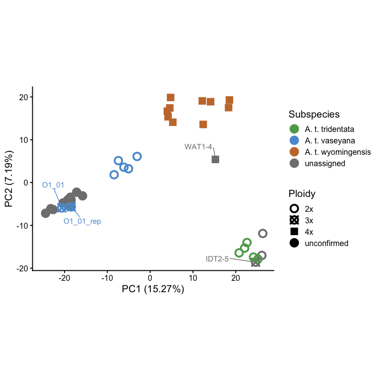
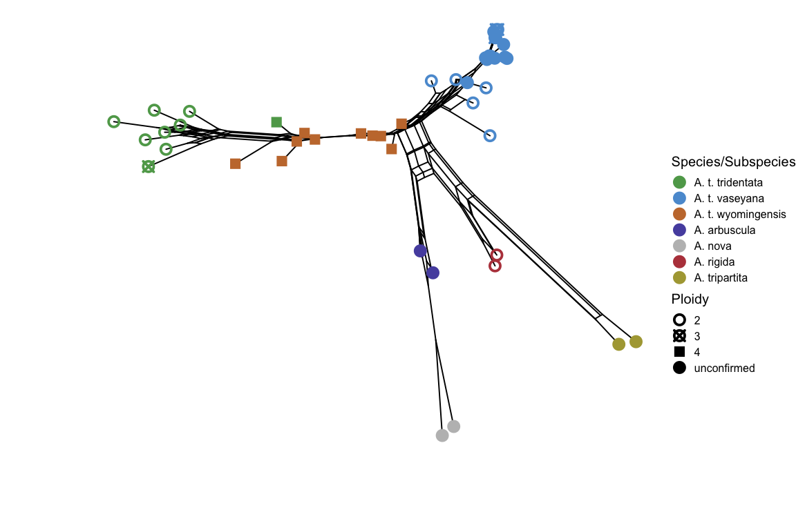
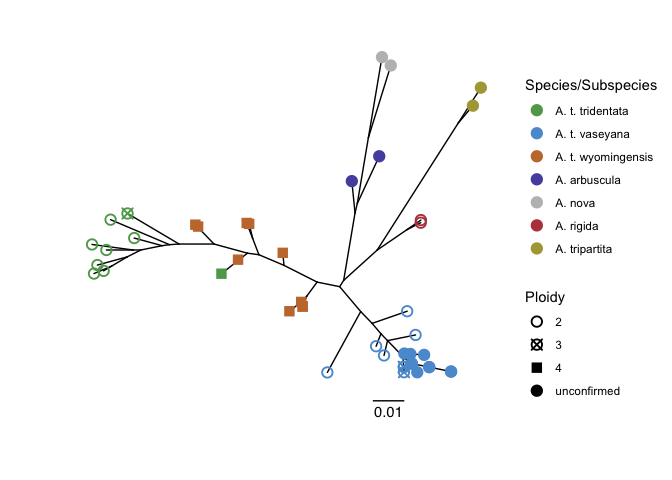
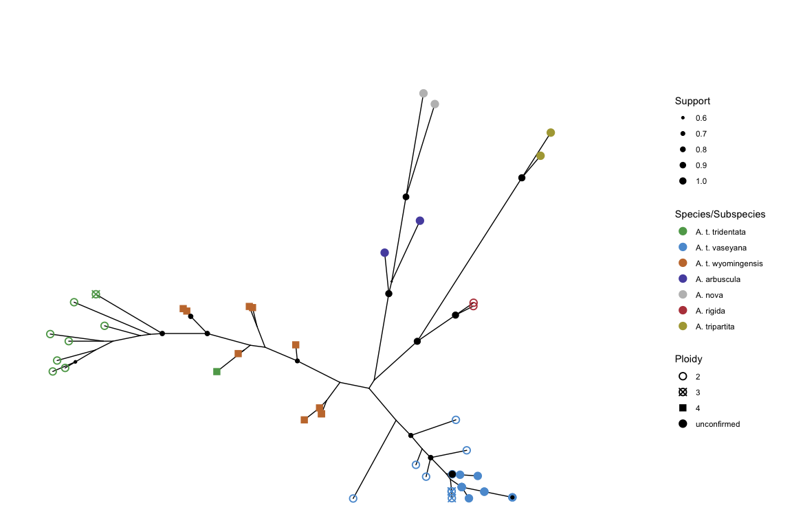

### PCA of ingroup samples

For the principal component analysis, we only use the 36 samples of A. tridentata subspecies (i.e. only ingroup). 


``` r
ingroup <- read.vcfR("data/vcf/ingrpR80miss15maf003DP5.recode.vcf") # read vcf file
```

```
## Scanning file to determine attributes.
## File attributes:
##   meta lines: 5506
##   header_line: 5507
##   variant count: 1020
##   column count: 47
## 
Meta line 1000 read in.
Meta line 2000 read in.
Meta line 3000 read in.
Meta line 4000 read in.
Meta line 5000 read in.
Meta line 5506 read in.
## All meta lines processed.
## gt matrix initialized.
## Character matrix gt created.
##   Character matrix gt rows: 1020
##   Character matrix gt cols: 47
##   skip: 0
##   nrows: 1020
##   row_num: 0
## 
Processed variant 1000
Processed variant: 1020
## All variants processed
```

We can confirm that our samples contains the ingroup samples (39) as well as 1020 SNPs. The column count shown above equals the (39) sample columns + 8 fix columns (i.e. CHROM, POS, etc.)

We can then read the data passport data (i.e. Table S1), recode (factor) and reorder (levels) the species/subspecies codes. 


``` r
sample_info <- read_excel("data/tables/Supplementary_Table.xlsx", sheet=2) #read sample info file; sheet2==passport data

#recode chr to fct and reorder levels for plotting 
sample_info <- sample_info %>%
  mutate(spp_ssp_code_PCA=factor(spp_ssp_code_PCA, 
                                 levels=c("tri","vas","wyo", "unassigned")), 
         spp_ssp_code_phylogeny=factor(spp_ssp_code_phylogeny, 
                                       levels=c("tri","vas","wyo", "arb", "nov", "rig", "trip")))
```

Once this tidying step is complete, we can convert the vcf to genind which contains individual genotypes and is stored in a matrix. We can use this and impute missing values by the mean of the allele frequencies, which subsequently serves as input for the PCA.


``` r
x <- vcfR2genind(ingroup) # convert vcf to genind format
x.tab <- tab(x, freq=TRUE, NA.method="mean") #access allele frequencies

x.pca <- dudi.pca(x.tab,
                  scannf = F, #do not display scree plot
                  scale = T, #norm the column vectors for the row.w weighting
                  nf = 5, #number of kept axes
                  center = T)#centering by the mean
pca_data <- x.pca$li #extract the row coordinates i.e. the principal components
ex_var <- x.pca$eig/sum(x.pca$eig)*100 #calcualte explained variance in percent
```

Finally, we can plot and customize the PCA. 


``` r
pca_data <- pca_data %>%
  rownames_to_column(var="Sample_ID")

#join sample information
pca.data.comb <- left_join(pca_data, sample_info, by="Sample_ID")

PC12 <- ggplot(pca.data.comb, aes(x=Axis1, 
                                  y=Axis2, 
                                  col=spp_ssp_code_PCA, 
                                  pch=as.factor(ploidy_level)))+
  geom_point(size=4, stroke=2)+
  scale_color_manual(values=cols.list.ingrp3tax, 
                     labels=labs.list.ingrp3tax, 
                     name="Subspecies") +
  scale_shape_manual(values=c(1,13,15,19), 
                     na.value = 16, 
                     name="Ploidy", 
                     labels=labs.list.ploidy)+
  #subset samples for hightlighted plotting
  geom_text_repel(data = pca.data.comb %>% 
                    mutate(label = ifelse(Sample_ID %in%  c("WAT1-4", "IDT2-5", "O1_01", "O1_01_rep"),
                                          Sample_ID, "")),
                  aes(label = label), 
                  box.padding = 1, nudge_x = -0.5, nudge_y = 0.5,
                  show.legend = FALSE, max.overlaps = 15, size=4)+
  labs(x=paste0("PC1 (", round(ex_var[1],2),"%)"),
       y=paste0("PC2 (", round(ex_var[2],2), "%)"))+
  coord_equal()+
  theme_classic(base_size = 15)

print(PC12)
```

<!-- -->

``` r
ggsave(plot=PC12, "results/figures/PC12.pdf", device = "pdf", height = 6, width=8)
```


### Phylogenetics

To conduct a phylogenetic analysis and infer whether some of the related Artemisia species contributed to polyploid formation, we include 4 outgroup taxa (2 samples each). 


This fasta file contains 46 samples, and 696 SNPs.

#### Splitnet

Among the first things to calculate is a phylogenetic network, that, in short, incorporate reticulations into the network at
points where the data have conflicting signals. 
To construct a phylogenetic network, we utilize the function dist.ml of phangorn to calculate pairwise distances and then construct the network using neighbotNet, that implements the method of Bryant and Moulton (2004). For plotting, we can use the `tanggle` package by Schliep et al. 2018.


``` r
dm <- dist.ml(artr)
sb.nnet <- neighborNet(dm)
splitnet <- ggsplitnet(sb.nnet)
splitnet$data <- left_join(splitnet$data, sample_info, by = c("label"="Sample_ID"))

splitnet_plot <- splitnet +
  geom_tippoint(aes(color=spp_ssp_code_phylogeny, 
                    pch=as.factor(ploidy_level)), size=4, stroke=2)+
  scale_color_manual(values=cols.list.outgrp,
                     labels=labels.col.outgrp) +
  scale_shape_manual(values=shp.list.ploidy)+
  ggexpand(.1, direction=-1)+
  labs(shape="Ploidy", col="Species/Subspecies")+
  theme_void(base_size=15)

ggsave(plot=splitnet_plot, "results/figures/Splitnet.pdf", device = "pdf", height = 6, width=8)
print(splitnet_plot)
```

<!-- -->

### Maximum Likelihood Analysis
#### Model Testing

To construct a maximum likelihood phylogenetic tree, we first identify which substition model best fits the data, using the phangorn modelTest function.


```
##   Model df    logLik      AIC      AICw     AICc     AICcw     BIC
## 1   TVM 96 -3126.633 6445.266 0.2718602 6476.358 0.3769848 6881.62
```

### Conducting ML

We then infer a phylogenetic tree using maximum likelihood (ML) and stochastic tree rearrangement to improve resolution of tree topologies.


``` r
fit_mt <- pml_bb(mt, #result of model test
                 model = "BIC", #use best use best BIC
                 rearrangement = "stochastic", #perform stochastic tree rearrangement
                 method = "unrooted", #estimate unrooted tree
                 control = pml.control(trace = 0))

#generate unrooted phylogeny using the equal angle layout
p <- ggtree(fit_mt$tree,
            layout="equal_angle") 
#join data to the tree element
p$data <- p$data %>% 
  left_join(sample_info, by = c("label"="Sample_ID"))

#plot and annotate tree
p.fitmt <- p +
  geom_tippoint(aes(color=spp_ssp_code_phylogeny,  # color by spp and ssp
                    pch=as.factor(ploidy_level)), #shape by ploidy
                size=3, stroke=1)+ #increase size for better visibility
  scale_color_manual(values=cols.list.outgrp, #adjust colors
                     labels=labels.col.outgrp) + #adjust color labels
  scale_shape_manual(values=shp.list.ploidy)+ #adjust shapes
  ggexpand(.1, direction=-1)+
  geom_treescale(offset = -0.005, #provide treescale
                 offset.label = -0.01, x=-0.01, y=-0.015)+ 
  labs(shape="Ploidy", col="Species/Subspecies") 

print(p.fitmt)
```

<!-- -->

``` r
ggsave(plot=p.fitmt, "results/figures/ML_Phylogeny.pdf", device = "pdf")
```

### Perform non-parametric bootstrap analysis 

Finally, we can use the tree and perform a bootstrap analysis to assess node support.


``` r
bs <- bootstrap.pml(fit_mt, #input fitted model
                    bs=100, #nbootstrap replicates
                    optNni=TRUE, #nearest neighbor optimization
                    multicore = T, # use multiple cores (8)
                    mc.cores = 8)

#generate a consensus network
treeBS <- plotBS(fit_mt$tree,bs,type = "unrooted", digits = 2, plot=F)
```

``` r
BS <- ggtree(treeBS, layout = "equal_angle")

BS$data <- BS$data %>% 
  left_join(sample_info, by = c("label"="Sample_ID"))

BS_plot <- BS + 
  geom_tippoint(aes(color=spp_ssp_code_phylogeny, 
                    pch=as.factor(ploidy_level)), 
                hjust=-.1, 
                size=3, stroke=1)+
  scale_color_manual(values=cols.list.outgrp, 
                     labels=labels.col.outgrp) +
  scale_shape_manual(values=shp.list.ploidy)+
  ggexpand(.1)+
  labs(shape="Ploidy", col="Species/Subspecies")+
   geom_nodepoint(aes(subset=as.numeric(label)>0.5, size=as.numeric(label)))+
  scale_size(range = c(0, 3))+
  labs(size="Support")

ggsave(plot=BS_plot, "results/figures/BS_Phylogeny.pdf", device = "pdf")
```

``` r
print(BS_plot)
```

```
## Warning in FUN(X[[i]], ...): NAs introduced by coercion
## Warning in FUN(X[[i]], ...): NAs introduced by coercion
```

<!-- -->


``` r
sessionInfo()
```

```
## R version 4.5.2 (2025-10-31)
## Platform: aarch64-apple-darwin20
## Running under: macOS Tahoe 26.3.1
## 
## Matrix products: default
## BLAS:   /System/Library/Frameworks/Accelerate.framework/Versions/A/Frameworks/vecLib.framework/Versions/A/libBLAS.dylib 
## LAPACK: /Library/Frameworks/R.framework/Versions/4.5-arm64/Resources/lib/libRlapack.dylib;  LAPACK version 3.12.1
## 
## locale:
## [1] en_US.UTF-8/en_US.UTF-8/en_US.UTF-8/C/en_US.UTF-8/en_US.UTF-8
## 
## time zone: Europe/Vienna
## tzcode source: internal
## 
## attached base packages:
## [1] grid      stats     graphics  grDevices utils     datasets  methods  
## [8] base     
## 
## other attached packages:
##  [1] vcfR_1.16.0     lubridate_1.9.5 forcats_1.0.1   stringr_1.6.0  
##  [5] dplyr_1.2.0     readr_2.2.0     tidyr_1.3.2     tibble_3.3.1   
##  [9] tidyverse_2.0.0 tidytree_0.4.7  tanggle_1.16.0  readxl_1.4.5   
## [13] purrr_1.2.1     phytools_2.5-2  maps_3.4.3      phangorn_2.12.1
## [17] patchwork_1.3.2 ggtree_4.0.4    ggrepel_0.9.7   gridExtra_2.3  
## [21] ggpubr_0.6.3    ggplot2_4.0.2   ape_5.8-1       adegenet_2.1.11
## [25] ade4_1.7-23    
## 
## loaded via a namespace (and not attached):
##   [1] mnormt_2.1.2            permute_0.9-10          rlang_1.1.7            
##   [4] magrittr_2.0.4          otel_0.2.0              compiler_4.5.2         
##   [7] mgcv_1.9-4              systemfonts_1.3.2       vctrs_0.7.1            
##  [10] reshape2_1.4.5          combinat_0.0-8          quadprog_1.5-8         
##  [13] memuse_4.2-3            pkgconfig_2.0.3         fastmap_1.2.0          
##  [16] backports_1.5.0         labeling_0.4.3          promises_1.5.0         
##  [19] rmarkdown_2.30          tzdb_0.5.0              ragg_1.5.1             
##  [22] xfun_0.56               cachem_1.1.0            seqinr_4.2-36          
##  [25] aplot_0.2.9             clusterGeneration_1.3.8 jsonlite_2.0.0         
##  [28] later_1.4.8             broom_1.0.12            parallel_4.5.2         
##  [31] cluster_2.1.8.2         R6_2.6.1                bslib_0.10.0           
##  [34] stringi_1.8.7           RColorBrewer_1.1-3      car_3.1-5              
##  [37] cellranger_1.1.0        numDeriv_2016.8-1.1     jquerylib_0.1.4        
##  [40] Rcpp_1.1.1              iterators_1.0.14        knitr_1.51             
##  [43] optimParallel_1.0-2     timechange_0.4.0        httpuv_1.6.16          
##  [46] Matrix_1.7-4            splines_4.5.2           igraph_2.2.2           
##  [49] tidyselect_1.2.1        rstudioapi_0.18.0       abind_1.4-8            
##  [52] yaml_2.3.12             vegan_2.7-3             doParallel_1.0.17      
##  [55] codetools_0.2-20        lattice_0.22-9          plyr_1.8.9             
##  [58] shiny_1.13.0            treeio_1.34.0           withr_3.0.2            
##  [61] S7_0.2.1                coda_0.19-4.1           evaluate_1.0.5         
##  [64] pinfsc50_1.3.0          gridGraphics_0.5-1      pillar_1.11.1          
##  [67] carData_3.0-6           foreach_1.5.2           ggfun_0.2.0            
##  [70] generics_0.1.4          hms_1.1.4               scales_1.4.0           
##  [73] xtable_1.8-8            glue_1.8.0              gdtools_0.5.0          
##  [76] scatterplot3d_0.3-45    lazyeval_0.2.2          tools_4.5.2            
##  [79] ggsignif_0.6.4          ggiraph_0.9.6           fs_1.6.7               
##  [82] fastmatch_1.1-8         colorspace_2.1-2        nlme_3.1-168           
##  [85] Formula_1.2-5           cli_3.6.5               rappdirs_0.3.4         
##  [88] DEoptim_2.2-8           textshaping_1.0.5       fontBitstreamVera_0.1.1
##  [91] expm_1.0-0              viridisLite_0.4.3       gtable_0.3.6           
##  [94] rstatix_0.7.3           yulab.utils_0.2.4       sass_0.4.10            
##  [97] digest_0.6.39           fontquiver_0.2.1        ggplotify_0.1.3        
## [100] htmlwidgets_1.6.4       farver_2.1.2            htmltools_0.5.9        
## [103] lifecycle_1.0.5         mime_0.13               fontLiberation_0.1.0   
## [106] MASS_7.3-65
```

