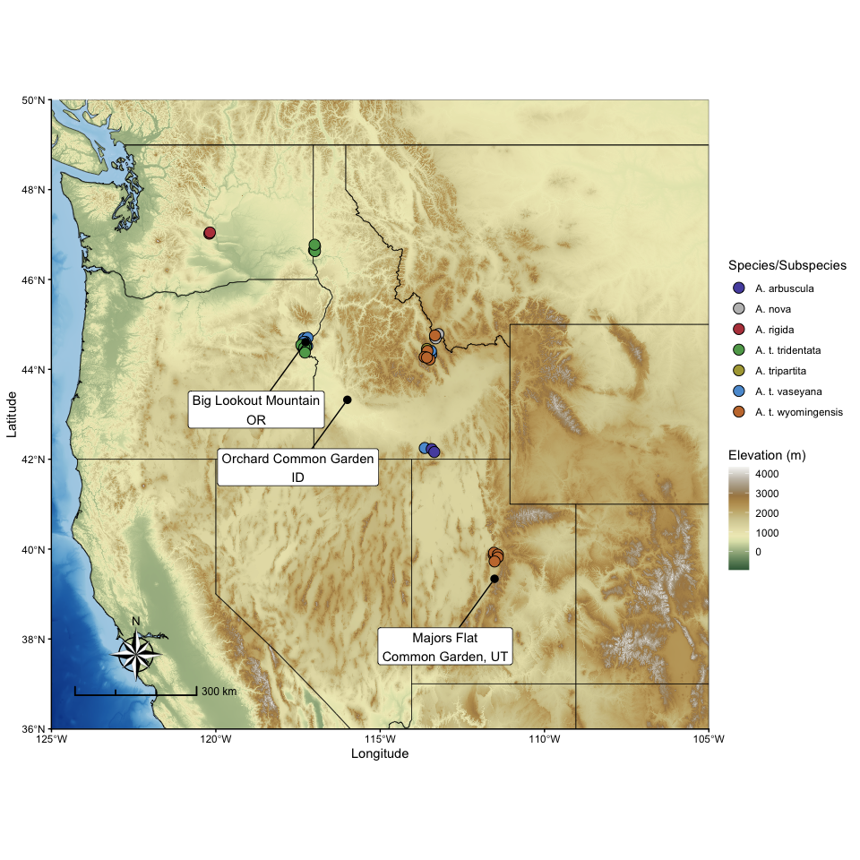

Triploid_Map
================
Lukas P. Grossfurthner
2026-03-13

- [Triploid Map](#triploid-map)

## Triploid Map

This is the code for automatized map generations. More explanations
soon.

``` r
#Read file continaing coordinates
data <- read_excel("data/tables/Supplementary_Table.xlsx",sheet=2)


pts_sf <- st_as_sf(data,
                   coords = c("Plot_Longitude", "Plot_Latitude"),
                   crs = 4326) %>% 
  mutate(geometry = st_jitter(geometry, amount = 0.12))

## Download country and statefiles from Naturalearth
countries <- ne_countries(scale = "medium", returnclass = "sf")
us_states <- ne_states(country = "United States of America",
                       returnclass = "sf")

##### IF WANTING TO EXTRACT REGIONS AUTOMATICALLY BY POINTS:
# Specify buffer around outermost points (km)
buffer_km <- 0
# provide resolution for elevation raster (lower = faster, higher = prettier)
elev_z <- 7
# Bounding box from points
bbox <- st_bbox(pts_sf)

#### OREXTRACT REGIONS AUTOMATICALLY BY EXTENT:####
#bounding box from extent
bbox <- st_bbox(c(
  xmin = -125,
  ymin = 36,
  xmax = -105,
  ymax = 50), crs = 4326)

### convert to sf file ###ä
bbox_sf <- st_as_sfc(bbox)
# Project to metric CRS
bbox_m <- st_transform(bbox_sf, 3857)
# Buffer
bbox_buf_m <- st_buffer(bbox_m, buffer_km * 1000)

# Back to WGS84
bbox_buf <- st_transform(bbox_buf_m, 4326)
bbox_buf.sf <- st_as_sf(bbox_buf)

# Download elevation raster and convert to spatraster
dem <- get_elev_raster(
  locations = bbox_buf.sf,
  z = elev_z
)
```

    ## Mosaicing & Projecting

    ## Note: Elevation units are in meters.

``` r
dem <- rast(dem)

### crop the country file to the specified bbox
countries_crop <- st_intersection(
  countries,
  st_make_valid(bbox_buf)
)
```

    ## although coordinates are longitude/latitude, st_intersection assumes that they
    ## are planar

    ## Warning: attribute variables are assumed to be spatially constant throughout
    ## all geometries

``` r
## IF water outside of country, extract use everything outside of the country borders.  
water <- st_difference(
  st_make_valid(bbox_buf),
  st_union(countries)
)
```

    ## although coordinates are longitude/latitude, st_union assumes that they are
    ## planar

    ## although coordinates are longitude/latitude, st_difference assumes that they
    ## are planar

``` r
water_vect <- vect(water)

### crop everything to 
countries_crop <- st_crop(countries, bbox_buf)
```

    ## although coordinates are longitude/latitude, st_intersection assumes that they
    ## are planar

    ## Warning: attribute variables are assumed to be spatially constant throughout
    ## all geometries

``` r
us_states_crop <- st_crop(us_states, bbox_buf)
```

    ## although coordinates are longitude/latitude, st_intersection assumes that they
    ## are planar

    ## Warning: attribute variables are assumed to be spatially constant throughout
    ## all geometries

``` r
dem_df <- as.data.frame(dem, xy = TRUE, na.rm = TRUE)
colnames(dem_df) <- c("x", "y", "elevation")

### IF Multiple countries in bbox (i.e. USA and Canada), perform union to make a land only vector for the dem
land <- countries |>
  st_make_valid() |>
  st_union() |>
  st_crop(bbox_buf)
```

    ## although coordinates are longitude/latitude, st_union assumes that they are
    ## planar

    ## although coordinates are longitude/latitude, st_intersection assumes that they
    ## are planar

``` r
land_vect <- vect(land)
land_vect <- project(land_vect, crs(dem))

##mask everything outside of the land vector
dem_land <- mask(dem, land_vect)

##mask the landvector to retain oceans
dem_water <- mask(dem, water_vect, inverse = F)
water_df <- as.data.frame(dem_water, xy = TRUE, na.rm = TRUE)
colnames(water_df) <- c("x", "y", "elevation")

# Compute slope and aspect of land vector
slope  <- terrain(dem_land, v = "slope", unit = "radians")
aspect <- terrain(dem_land, v = "aspect", unit = "radians")

dirs <- c(270, 15, 60, 330)  # multiple sun directions
hillmulti <- purrr::map(dirs, ~shade(slope, aspect, angle = 45, direction = .x, normalize = TRUE))
hillmulti_rast <- rast(hillmulti) |> sum(na.rm = TRUE)

# Convert hillshade to dataframe
hillmulti_df <- as.data.frame(hillmulti_rast, xy = TRUE, na.rm = TRUE)
colnames(hillmulti_df) <- c("x","y","hillshade")

# Mask hillshade to land only
#hillshade_land <- mask(hillshade, land_vect)

# Convert rasters to data frames for ggplot
land_df <- as.data.frame(dem_land, xy = TRUE, na.rm = TRUE)
colnames(land_df) <- c("x", "y", "elevation")


### Basemap with coords
basemap <- ggplot() +
  geom_raster(data=water_df, aes(x = x, y = y, fill = elevation))+
  scale_fill_distiller(na.value = "", guide="none")+
  new_scale_fill()+
  geom_raster(
    data = hillmulti_df,
    aes(x = x, y = y, fill = hillshade)) +
  scale_fill_distiller(palette = "Greys", na.value = "", guide="none")+
   new_scale_fill()+
   geom_raster(data = land_df,
               aes(x = x, y = y, fill = elevation)) +
  scale_fill_wiki_c(
     alpha = 1,
     direction = 1,
     na.value = "",
     name = "Elevation (m)") +
  scale_alpha(range = c(0, 0.4), guide = "none") +
  geom_sf(data = countries_crop,
          fill = NA,
          color = "black")+
  coord_sf(expand = c(0,0),
           xlim = st_bbox(bbox_buf.sf)[c("xmin", "xmax")],
           ylim = st_bbox(bbox_buf.sf)[c("ymin", "ymax")])+
  geom_sf(data=us_states_crop,
          fill = NA,
          color = "black")
```

    ## Coordinate system already present.
    ## ℹ Adding new coordinate system, which will replace the existing one.

``` r
###customiuze

custom_map <- basemap+
  new_scale_fill()+
  geom_sf(data = pts_sf,
          aes(fill= spp_ssp_code_phylogeny), 
          color="black",
          pch=21, 
          size=4)+
  scale_fill_manual(values=cols.list.outgrp, labels=labels.col.outgrp, name="Species/Subspecies")+
  geom_point(data=site_coords_triploid, 
             aes(x=lon,
                 y=lat), 
             color="black", size=3, pch=16)+
  geom_label_repel(data=site_coords_triploid, 
                   aes(x=lon,
                       y=lat,  label=labs), 
                   point.padding = 0.2, 
                   nudge_x = -1.5,
                   nudge_y = -1.5 )+
  theme(legend.position = "none", axis.title = element_blank(), text = element_text(size = 12))+
  theme_classic()+
  #theme_minimal(base_family = "notoserif", base_size=13)+
  coord_sf(expand = F)+
  ggspatial::annotation_scale(
    location = "bl",
    style="ticks",
    pad_x = unit(0.7, "cm"), #0.2
    pad_y = unit(1, "cm"),
    width_hint=0.2, 
    line_width = 1.8, 
    text_cex = 0.75
  )+
  annotation_north_arrow(location = "bl", 
                         which_north = "true",
                         style = north_arrow_nautical,#north_arrow_minimal,
                         pad_y = unit(1.4, "cm"),
                         pad_x = unit(1.5, "cm"),
                         height = unit(2, "cm"),
                         width = unit(2, "cm")
  )+
  labs(x="Longitude", y="Latitude")

ggsave(plot=custom_map, "results/figures/final_map.pdf",device = "pdf", height = 8, width=8 )
```

    ## Scale on map varies by more than 10%, scale bar may be inaccurate

``` r
print(custom_map)
```

    ## Scale on map varies by more than 10%, scale bar may be inaccurate

<!-- -->

``` r
sessionInfo()
```

    ## R version 4.5.2 (2025-10-31)
    ## Platform: aarch64-apple-darwin20
    ## Running under: macOS Tahoe 26.3.1
    ## 
    ## Matrix products: default
    ## BLAS:   /System/Library/Frameworks/Accelerate.framework/Versions/A/Frameworks/vecLib.framework/Versions/A/libBLAS.dylib 
    ## LAPACK: /Library/Frameworks/R.framework/Versions/4.5-arm64/Resources/lib/libRlapack.dylib;  LAPACK version 3.12.1
    ## 
    ## locale:
    ## [1] en_US.UTF-8/en_US.UTF-8/en_US.UTF-8/C/en_US.UTF-8/en_US.UTF-8
    ## 
    ## time zone: Europe/Vienna
    ## tzcode source: internal
    ## 
    ## attached base packages:
    ## [1] grid      stats     graphics  grDevices utils     datasets  methods  
    ## [8] base     
    ## 
    ## other attached packages:
    ##  [1] ggrepel_0.9.7           rnaturalearthdata_1.0.0 rnaturalearth_1.2.0    
    ##  [4] osmdata_0.3.0           tidyterra_1.0.0         scales_1.4.0           
    ##  [7] readxl_1.4.5            zoo_1.8-15              viridis_0.6.5          
    ## [10] viridisLite_0.4.3       lubridate_1.9.5         forcats_1.0.1          
    ## [13] stringr_1.6.0           dplyr_1.2.0             purrr_1.2.1            
    ## [16] readr_2.2.0             tidyr_1.3.2             tibble_3.3.1           
    ## [19] ggplot2_4.0.2           tidyverse_2.0.0         raster_3.6-32          
    ## [22] sp_2.2-1                sf_1.1-0                terra_1.9-1            
    ## [25] lwgeom_0.2-15           mapdata_2.3.1           maps_3.4.3             
    ## [28] gridExtra_2.3           gtable_0.3.6            ggnewscale_0.5.2       
    ## [31] ggspatial_1.1.10        geosphere_1.6-5         elevatr_0.99.1         
    ## [34] data.table_1.18.2.1    
    ## 
    ## loaded via a namespace (and not attached):
    ##  [1] tidyselect_1.2.1              farver_2.1.2                 
    ##  [3] S7_0.2.1                      fastmap_1.2.0                
    ##  [5] digest_0.6.39                 timechange_0.4.0             
    ##  [7] lifecycle_1.0.5               magrittr_2.0.4               
    ##  [9] compiler_4.5.2                rlang_1.1.7                  
    ## [11] progress_1.2.3                tools_4.5.2                  
    ## [13] yaml_2.3.12                   knitr_1.51                   
    ## [15] labeling_0.4.3                prettyunits_1.2.0            
    ## [17] classInt_0.4-11               curl_7.0.0                   
    ## [19] RColorBrewer_1.1-3            KernSmooth_2.23-26           
    ## [21] withr_3.0.2                   e1071_1.7-17                 
    ## [23] progressr_0.18.0              cli_3.6.5                    
    ## [25] rmarkdown_2.30                crayon_1.5.3                 
    ## [27] ragg_1.5.1                    generics_0.1.4               
    ## [29] otel_0.2.0                    rstudioapi_0.18.0            
    ## [31] httr_1.4.8                    tzdb_0.5.0                   
    ## [33] DBI_1.3.0                     proxy_0.4-29                 
    ## [35] slippymath_0.3.1              cellranger_1.1.0             
    ## [37] vctrs_0.7.1                   hms_1.1.4                    
    ## [39] systemfonts_1.3.2             units_1.0-0                  
    ## [41] rnaturalearthhires_1.0.0.9000 glue_1.8.0                   
    ## [43] codetools_0.2-20              stringi_1.8.7                
    ## [45] pillar_1.11.1                 htmltools_0.5.9              
    ## [47] R6_2.6.1                      textshaping_1.0.5            
    ## [49] evaluate_1.0.5                lattice_0.22-9               
    ## [51] class_7.3-23                  Rcpp_1.1.1                   
    ## [53] xfun_0.56                     pkgconfig_2.0.3
