Triploid_Progeny_Images
================
Grossfurthner,L.P.,
2026-03-24

- [Grown Plants](#grown-plants)

## Grown Plants

``` r
images <- list.files("images/original", full.names = T)
```

``` r
outpath <- "images/reduced_size"
dir.create(outpath, recursive = T)
```

    ## Warning in dir.create(outpath, recursive = T): 'images/reduced_size' already
    ## exists

``` r
for (i in 1:length(images)) {
  metadata <- read_exif(images[i])
  metadata <- metadata %>% mutate(DateTimeOriginal=as.POSIXct(DateTimeOriginal, 
                                     format = "%Y:%m:%d %H:%M:%S", 
                                     tz = "UTC"))
  

  data <- data.frame(file = str_remove_all(basename(metadata$SourceFile), ".jpeg"),
                     date_reformat=format(metadata$DateTimeOriginal, "%d %b %Y"),
                     tz=metadata$OffsetTimeOriginal,
                     lat=metadata$GPSLatitude,
                     lon=metadata$GPSLongitude)
  
  location_full <- reverse_geocode(.tbl = data,
  lat = lat,
  long = lon,
  method = "osm")
  
  location <- data.frame(str_split(location_full$address, 
                      pattern=",",
                      simplify = T, 
                      ))[c(3,5,7)] %>% paste(., collapse = ",") %>% 
  trimws(which="both")
  
  
  caption <- paste0(
    data$file, " | ",
    location," | ",
    data$date_reformat)
  
  img <- image_read(images[i])
  img_scaled <- image_scale(img, "80%")  
  img_scaled_strp <- image_strip(img_scaled)

  
  reduced_size <- file.path(outpath, basename(images[i]))
  
  image_write(
    img_scaled_strp,
    path = reduced_size,
    quality = 75)
  
  cat("\n\n", sep = "")
}
```

<figure>
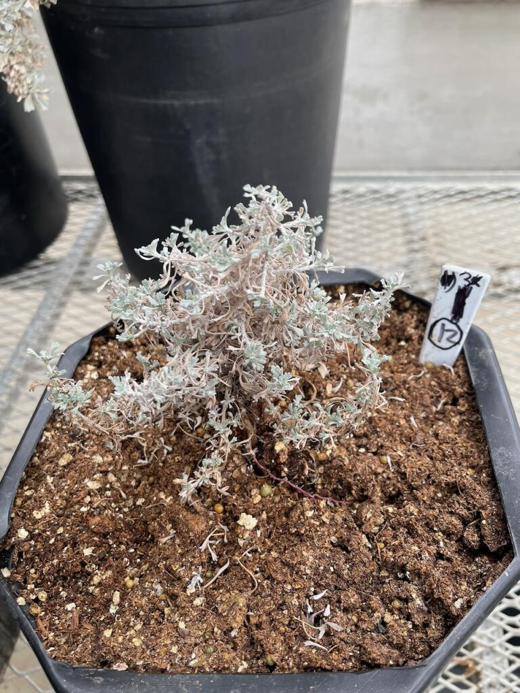
<figcaption aria-hidden="true">O101_sample12 | Moscow, Idaho, United
States | 01 Mar 2023</figcaption>
</figure>

<figure>
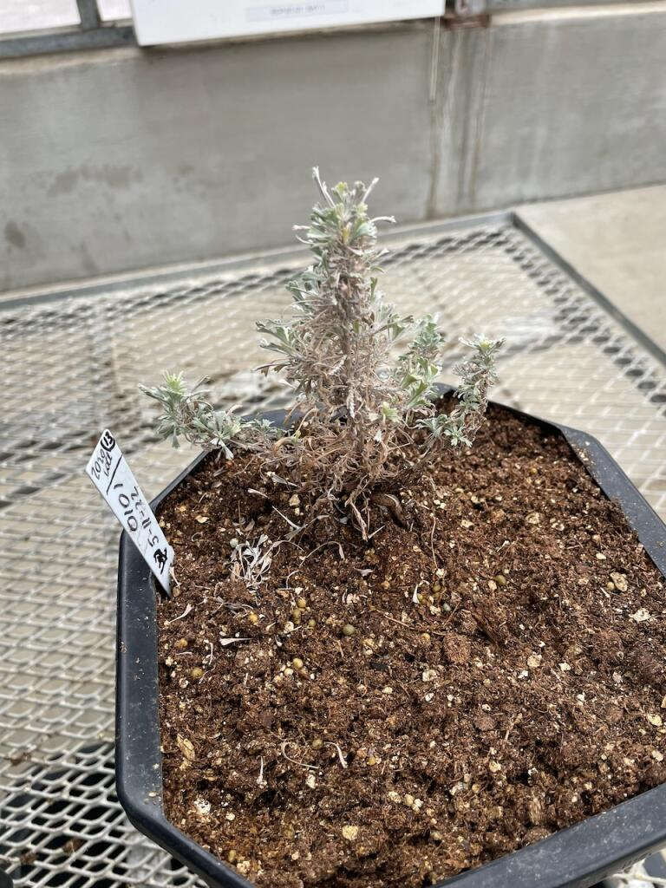
<figcaption aria-hidden="true">O101_sample13 | Moscow, Idaho, United
States | 01 Mar 2023</figcaption>
</figure>

<figure>
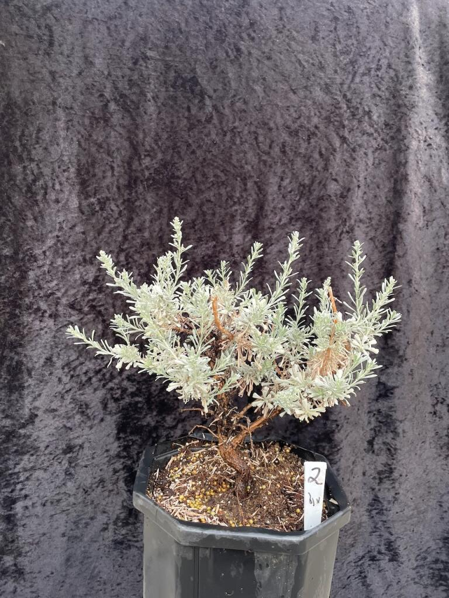
<figcaption aria-hidden="true">O101_sample2_03_23 | Moscow, Idaho,
United States | 07 Mar 2023</figcaption>
</figure>

<figure>
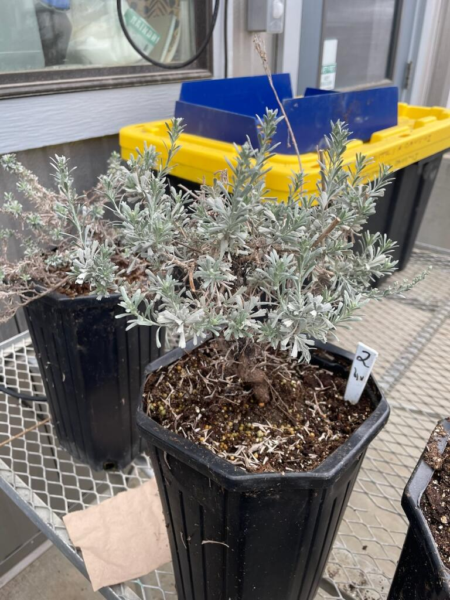
<figcaption aria-hidden="true">O101_sample2 | Moscow, Idaho, United
States | 01 Mar 2023</figcaption>
</figure>

<figure>
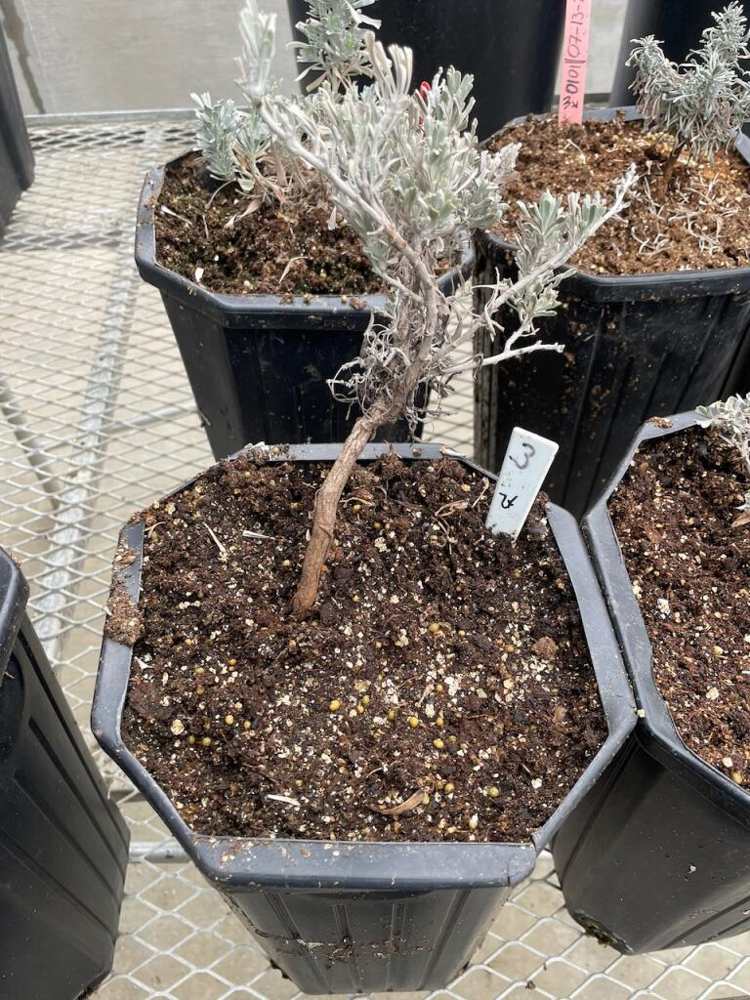
<figcaption aria-hidden="true">O101_sample3 | Moscow, Idaho, United
States | 01 Mar 2023</figcaption>
</figure>

<figure>
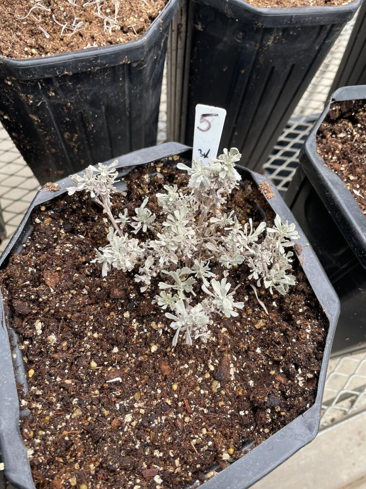
<figcaption aria-hidden="true">O101_sample5_03_23 | Moscow, Idaho,
United States | 01 Mar 2023</figcaption>
</figure>

<figure>
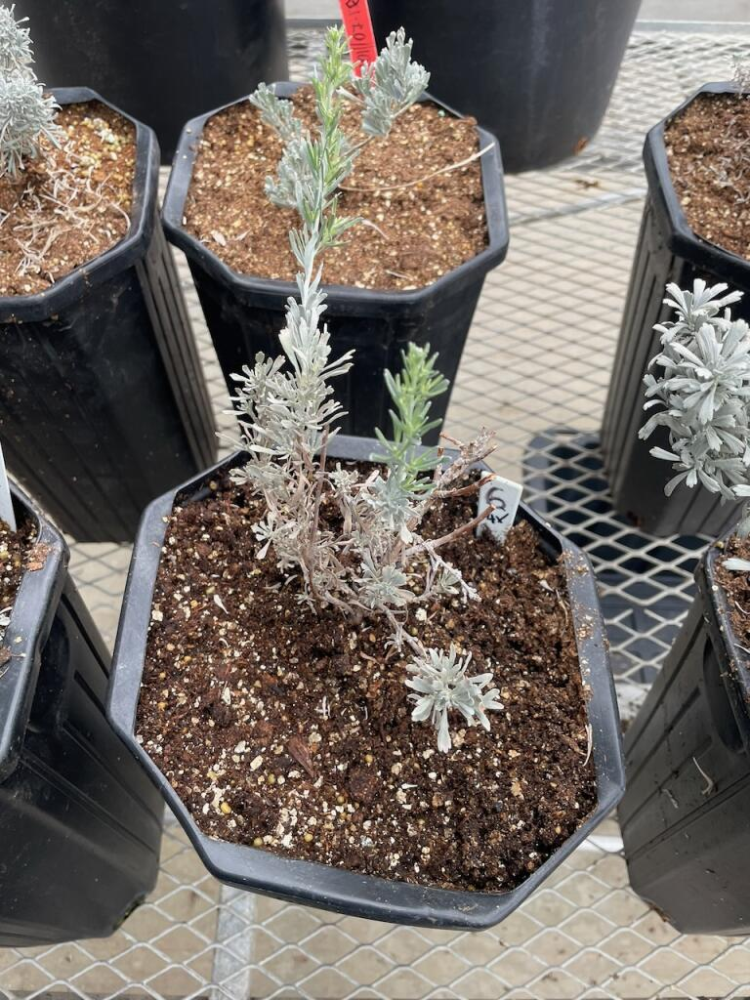
<figcaption aria-hidden="true">O101_sample6_03_23 | Moscow, Idaho,
United States | 01 Mar 2023</figcaption>
</figure>

<figure>
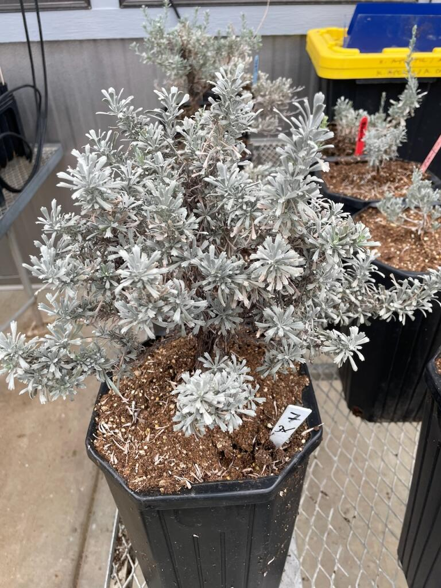
<figcaption aria-hidden="true">O101_sample7_03_23 | Moscow, Idaho,
United States | 01 Mar 2023</figcaption>
</figure>

<figure>
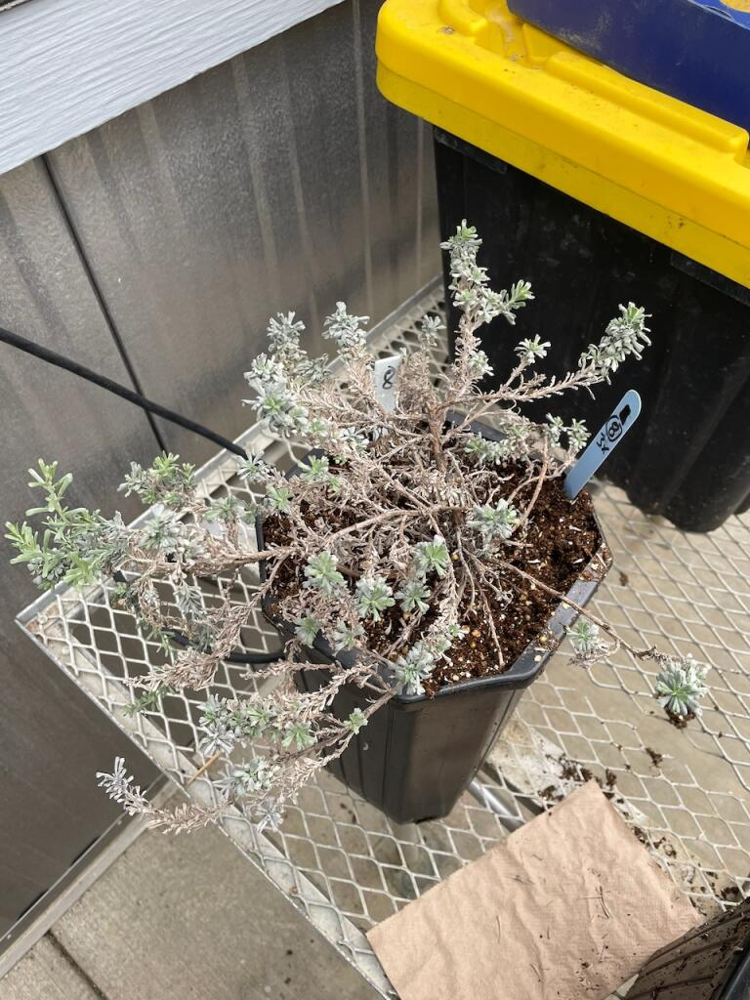
<figcaption aria-hidden="true">O101_sample8_03_23 | Moscow, Idaho,
United States | 01 Mar 2023</figcaption>
</figure>

<figure>
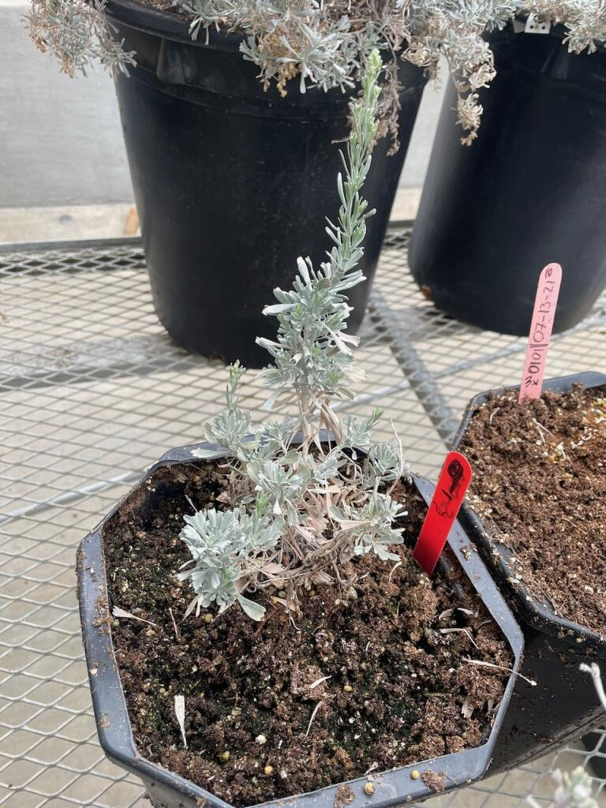
<figcaption aria-hidden="true">O101_sample9_03_23 | Moscow, Idaho,
United States | 01 Mar 2023</figcaption>
</figure>

<figure>
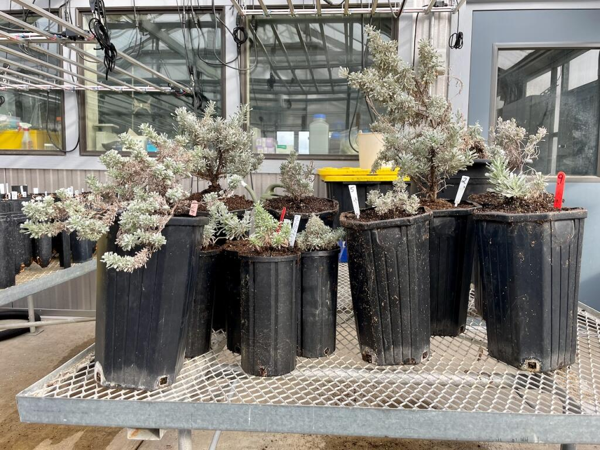
<figcaption aria-hidden="true">Tripl_Progeny_11_22 | Moscow, Idaho,
United States | 02 Nov 2022</figcaption>
</figure>

<figure>
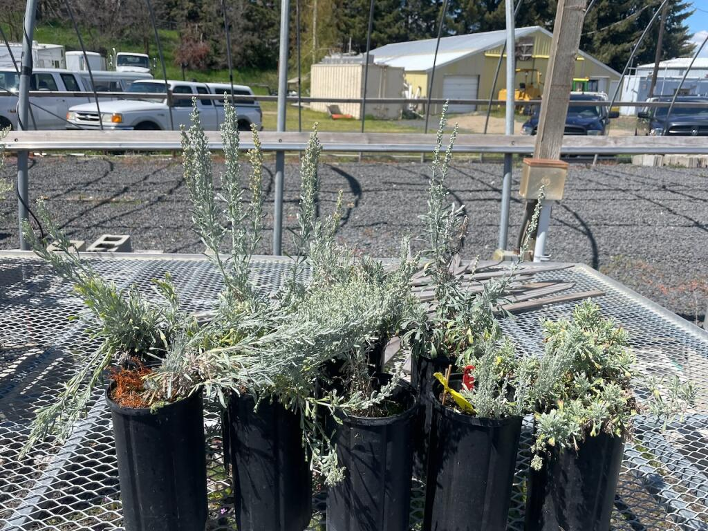
<figcaption aria-hidden="true">Tripl_Progeny_flowering_05_22_v1 |
Moscow, Idaho, United States | 11 May 2022</figcaption>
</figure>

<figure>
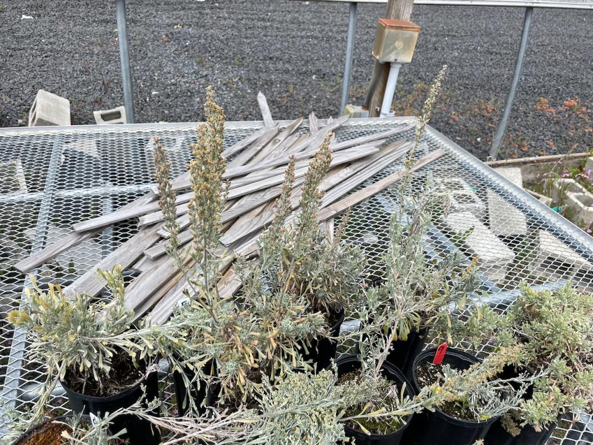
<figcaption aria-hidden="true">Tripl_Progeny_flowering_05_22 | Moscow,
Idaho, United States | 29 May 2022</figcaption>
</figure>
